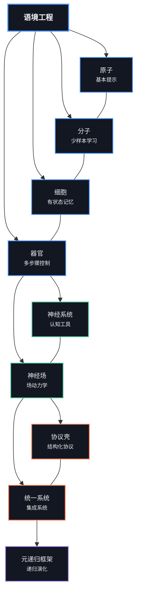

# 基础概念

> _从原子到统一场：语境工程的理论支柱_
>
>
> **"秩序从混沌的相互作用中涌现。"**
>— Ilya Prigogine

## [学习将语境可视化为语义网络和场](https://claude.ai/public/artifacts/6a078ba1-7941-43ef-aab1-bad800a3e10c)

## 概述

`00_foundations` 目录包含了语境工程的核心理论基础，从基本的提示概念到高级的统一场论逐步推进。每个模块都建立在前一个模块的基础之上，形成了一个综合框架，用于理解和操纵大型语言模型中的语境。

```
                    神经场
                         ▲
                         │
                    ┌────┴────┐
                    │         │
              ┌─────┴─┐     ┌─┴─────┐
              │       │     │       │
        ┌─────┴─┐   ┌─┴─────┴─┐   ┌─┴─────┐
        │       │   │         │   │       │
   ┌────┴───┐ ┌─┴───┴──┐ ┌────┴───┴┐ ┌────┴───┐
   │原子    │ │分子    │ │细胞    │ │器官    │
   └────────┘ └─────────┘ └─────────┘ └────────┘
      基本     少样本    有状态    多步骤
    提示    学习      记忆      控制
```



## 生物学隐喻

我们的方法围绕生物学隐喻构建，提供了一个直观的框架来理解语境工程日益增加的复杂性：

| 等级 | 隐喻 | 语境工程概念 |
|-------|----------|------------------------------|
| 1 | **原子** | 基本指令和提示 |
| 2 | **分子** | 少样本例子和演示 |
| 3 | **细胞** | 有状态记忆和对话 |
| 4 | **器官** | 多步骤应用和工作流 |
| 5 | **神经系统** | 认知工具和思维模型 |
| 6 | **神经场** | 连续语义景观 |

当我们逐级深入时，我们从离散的、静态的方法转向更连续的、动态的、涌现的系统。

## 模块进度

### 生物学基础（原子→器官）

1. [**01_atoms_prompting.md**](./01_atoms_prompting.md)
   - 基本提示技术
   - 原子级指令和约束
   - 直接提示工程

2. [**02_molecules_context.md**](./02_molecules_context.md)
   - 少样本学习
   - 演示和例子
   - 语境窗口和格式化

3. [**03_cells_memory.md**](./03_cells_memory.md)
   - 对话状态
   - 记忆机制
   - 信息持久性

4. [**04_organs_applications.md**](./04_organs_applications.md)
   - 多步骤工作流
   - 控制流和编排
   - 复杂应用

### 认知扩展

5. [**05_cognitive_tools.md**](./05_cognitive_tools.md)
   - 思维模型和框架
   - 推理模式
   - 结构化思维

6. [**06_advanced_applications.md**](./06_advanced_applications.md)
   - 实际实现策略
   - 领域特定的应用
   - 集成模式

7. [**07_prompt_programming.md**](./07_prompt_programming.md)
   - 类似代码的提示结构
   - 提示中的算法思维
   - 结构化推理

### 场论基础

8. [**08_neural_fields_foundations.md**](./08_neural_fields_foundations.md)
   - 语境作为连续场
   - 场的属性和动力学
   - 向量空间表示

9. [**09_persistence_and_resonance.md**](./09_persistence_and_resonance.md)
   - 语义持久性机制
   - 语义模式之间的共鸣
   - 场的稳定性和演化

10. [**10_field_orchestration.md**](./10_field_orchestration.md)
    - 协调多个场
    - 场交互和边界
    - 复杂场架构

### 高级理论框架

11. [**11_emergence_and_attractor_dynamics.md**](./11_emergence_and_attractor_dynamics.md)
    - 语境场中的涌现性质
    - 吸引子的形成和演化
    - 语义空间中的自组织

12. [**12_symbolic_mechanisms.md**](./12_symbolic_mechanisms.md)
    - LLM 中的涌现符号处理
    - 符号抽象和归纳
    - 机制可解释性

13. [**13_quantum_semantics.md**](./13_quantum_semantics.md)
    - 观察者依赖的含义
    - 非经典语境性
    - 量子启发的语义模型

14. [**14_unified_field_theory.md**](./14_unified_field_theory.md)
    - 场、符号和量子视角的集成
    - 多视角问题解决
    - 语境工程的统一框架

## 可视化学习路径

```
┌─────────────────────────────────────────────────────────────────────────┐
│                                                                         │
│  基础概念                        场论            统一框架 │
│                                                                         │
│  ┌───────┐ ┌───────┐ ┌───────┐     ┌───────┐ ┌───────┐     ┌───────┐   │
│  │原子  │ │细胞  │ │认知  │     │神经│ │涌现 │     │统一│   │
│  │分子  │ │器官  │ │工具  │     │场 │ │&   │     │场 │   │
│  │      │ │      │ │      │     │   │ │吸引│     │论 │   │
│  └───┬───┘ └───┬───┘ └───┬───┘     └───┬───┘ └───┬───┘     └───┬───┘   │
│      │         │         │             │         │             │       │
│      │         │         │             │         │             │       │
│      ▼         ▼         ▼             ▼         ▼             ▼       │
│  ┌─────────────────────────┐       ┌───────────────────┐   ┌─────────┐ │
│  │                         │       │                   │   │         │ │
│  │  传统语境工程          │       │  基于场的方法     │   │  统一  │ │
│  │                         │       │                   │   │ 框架  │ │
│  │                         │       │                   │   │         │ │
│  └─────────────────────────┘       └───────────────────┘   └─────────┘ │
│                                                                         │
└─────────────────────────────────────────────────────────────────────────┘
```

## 理论视角

我们的基础模块从三个互补的视角来处理语境工程：

```
                        ┌─────────────────┐
                        │                 │
                        │  场论视角      │
                        │  （连续）      │
                        │                 │
                        └─────────┬───────┘
                                  │
                                  │
                    ┌─────────────┴─────────────┐
                    │                           │
       ┌────────────┴────────────┐   ┌──────────┴───────────┐
       │                         │   │                      │
       │   符号视角              │   │   量子视角          │
       │   （机制化）            │   │   （观察者依赖）    │
       │                         │   │                      │
       └─────────────────────────┘   └──────────────────────┘
```

### 场论视角
将语境视为一个连续的语义景观，具有：
- **吸引子**：稳定的语义配置
- **共鸣**：模式之间的强化
- **持久性**：结构随时间的耐久性
- **边界**：语义区域之间的接口

### 符号视角
揭示 LLM 如何通过以下方式实现符号处理：
- **符号抽象**：将标记转换为抽象变量
- **符号归纳**：在变量上识别模式
- **检索**：将变量映射回具体的标记

### 量子视角
将含义建模为类似量子的现象，具有：
- **叠加**：多个可能的含义同时存在
- **测量**：解释"坍缩"叠加
- **非交换性**：语境操作的顺序很重要
- **语境性**：含义中的非经典相关性

## 关键概念图

```
                                ┌──────────────────┐
                                │                  │
                                │  语境场          │
                                │                  │
                                └────────┬─────────┘
                                         │
                 ┌────────────────┬──────┴───────┬────────────────┐
                 │                │              │                │
        ┌────────┴────────┐ ┌─────┴─────┐ ┌──────┴──────┐ ┌───────┴───────┐
        │                 │ │           │ │             │ │               │
        │    共鸣        │ │持久性     │ │  吸引子   │ │  边界         │
        │                 │ │           │ │             │ │               │
        └─────────────────┘ └───────────┘ └─────────────┘ └───────────────┘
                                          │
                                 ┌────────┴──────────┐
                                 │                   │
                       ┌─────────┴──────┐   ┌────────┴──────────┐
                       │                │   │                   │
                       │    涌现       │   │ 符号机制         │
                       │                │   │                   │
                       └────────────────┘   └───────────────────┘
                                                      │
                                           ┌──────────┴──────────┐
                                           │                     │
                                  ┌────────┴────────┐   ┌────────┴─────────┐
                                  │                 │   │                  │
                                  │    抽象        │   │     归纳        │
                                  │                 │   │                  │
                                  └─────────────────┘   └──────────────────┘
```

## 学习方法

每个模块都遵循以下教学原则：

1. **多视角学习**：从具体、数值和抽象的视角呈现概念
2. **直觉优先**：物理类比和可视化在形式定义之前建立直觉
3. **逐步复杂性**：每个模块都建立在前一个模块的基础上，逐步提高复杂性
4. **实践基础**：理论概念与实际实现相联系
5. **苏格拉底提问**：反思性问题鼓励更深层次的理解

## 阅读顺序

对于新手，我们建议按照模块的数字顺序（01 → 14）学习。然而，根据你的兴趣，不同的路径是可能的：

### 对于提示工程师
1 → 2 → 3 → 4 → 7 → 5

### 对于场论爱好者
8 → 9 → 10 → 11 → 14

### 对于符号机制粉丝
12 → 13 → 14

### 完整理解
从1到14的完整序列

## 与其他目录的集成

这个目录中的理论基础支持了库中其他地方的实际实现：

- **10_guides_zero_to_hero**：实现这些概念的实用笔记本
- **20_templates**：基于这些基础的可重用组件
- **30_examples**：这些原则的实际应用
- **40_reference**：详细的参考材料，扩展这些概念
- **60_protocols**：实现场论概念的协议壳
- **70_agents**：利用这些基础的代理实现
- **80_field_integration**：集成所有理论方法的完整系统

## 后续步骤

探索了这些基础之后，我们建议：

1. 尝试 `10_guides_zero_to_hero/` 中的实用笔记本
2. 尝试 `20_templates/` 中的模板
3. 研究 `30_examples/` 中的完整例子
4. 探索 `60_protocols/` 中的协议壳

## 基于场的学习可视化

```
                        语境场地图
            ┌─────────────────────────────────────────┐
            │                                         │
            │    ◎                                    │
            │   原子                       ◎         │
            │                            统一        │
            │                             场         │
            │                                         │
            │         ◎                               │
            │      分子       ◎                        │
            │                量子                      │
            │               语义学                    │
            │                                         │
            │   ◎                                     │
            │  细胞          ◎        ◎                │
            │             吸引子  符号                 │
            │                    机制                 │
            │                                         │
            │       ◎                                 │
            │     器官     ◎                          │
            │              场                        │
            │                                         │
            └─────────────────────────────────────────┘
               学习景观中的吸引子
```

我们框架中的每个概念都在语义景观中充当一个吸引子，引导你的理解走向对语境工程的稳定、连贯的解释。

---

*"世上最不可思议的事是这个世界是可以理解的。"*
— Albert Einstein
