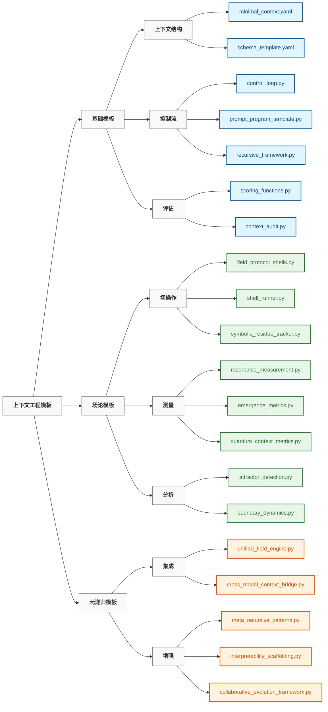

# 上下文工程模板

> "如果我们拒绝在语言的监狱中思考，我们就必须停止思考。" — **弗里德里希·尼采**

## 概述

`20_templates` 目录提供了一系列可复用、可组合的组件，用于在广泛的应用中实现上下文工程原理。每个模板都封装了一个特定的模式或机制，可以组合在一起创建复杂的上下文管理系统。

这些模板遵循一个渐进式复杂度模型，从基本结构开始，逐步发展到高级的场论实现：

```
原子 → 分子 → 细胞 → 器官 → 神经系统 → 神经场
  │      │       │      │       │          │
单个   少数   记忆/  多    认知工具   场 +
提示   提示   代理  代理  提示程序   持久化
```

## 模板分类



### 基础模板

用于基本上下文工程的基础构建块：

| 模板 | 用途 | 使用场景 |
|------|------|---------|
| [`minimal_context.yaml`](./minimal_context.yaml) | 通用LLM交互的轻量级模板 | 任何上下文工程项目的起点 |
| [`schema_template.yaml`](./schema_template.yaml) | 标准化上下文格式的数据结构定义 | 确保上下文表示的一致性 |
| [`control_loop.py`](./control_loop.py) | 迭代上下文处理框架 | 实现循环细化工作流 |
| [`prompt_program_template.py`](./prompt_program_template.py) | 复杂推理的结构化提示模式 | 创建类似代码的推理结构 |
| [`scoring_functions.py`](./scoring_functions.py) | 上下文质量的评估指标 | 量化评估上下文有效性 |

### 场论模板

实现神经场论原理的高级组件：

| 模板 | 用途 | 使用场景 |
|------|------|---------|
| [`field_protocol_shells.py`](./field_protocol_shells.py) | 场操作模板 | 实现标准化的场操作协议 |
| [`neural_field_context.yaml`](./neural_field_context.yaml) | 基于神经场的上下文配置 | 设置连续语义场 |
| [`resonance_measurement.py`](./resonance_measurement.py) | 场和谐测量工具 | 量化语义关系 |
| [`attractor_detection.py`](./attractor_detection.py) | 语义吸引子识别技术 | 在上下文场中寻找稳定模式 |
| [`symbolic_residue_tracker.py`](./symbolic_residue_tracker.py) | 符号碎片监控系统 | 追踪持久信息 |

### 元递归模板

用于自我改进和集成系统的高级模板：

| 模板 | 用途 | 使用场景 |
|------|------|---------|
| [`meta_recursive_patterns.py`](./meta_recursive_patterns.py) | 自我改进的模式 | 创建能够增强自身的系统 |
| [`unified_field_engine.py`](./unified_field_engine.py) | 多个场操作的集成 | 协调复杂的场交互 |
| [`interpretability_scaffolding.py`](./interpretability_scaffolding.py) | 透明度框架 | 使操作保持可理解 |
| [`collaborative_evolution_framework.py`](./collaborative_evolution_framework.py) | 人机合作结构 | 促进有效的协作 |
| [`cross_modal_context_bridge.py`](./cross_modal_context_bridge.py) | 多模态集成模式 | 统一不同模态的理解 |

## 实现策略

这些模板遵循一致的实现策略，包含以下原则：

1. **分层方法**：从基本概念逐步构建到高级集成
2. **实践重点**：确保所有理论都有相应的实际实现
3. **模块化设计**：创建可重新组合的可组合组件
4. **渐进式复杂度**：从简单开始，逐步增加复杂性
5. **集成重点**：关注组件如何协同工作，而不仅是单独工作
6. **自我改进**：构建能够增强自身的系统
7. **透明性**：确保操作即使在复杂性增加时也保持可理解
8. **协作**：为有效的人机合作而设计
9. **模态灵活性**：支持跨不同模态的统一理解

## 使用模式

### 基础模板适配

可以通过简单的配置更改来适配模板：

```python
import yaml

# 加载模板
with open('minimal_context.yaml', 'r') as f:
    context_template = yaml.safe_load(f)

# 为您的特定用例进行自定义
context_template['system']['role'] = "specialized_assistant"
context_template['token_budget'] = 500

# 使用自定义模板
# ...
```

### 组件组合

组合多个模板以创建复杂的系统：

```python
from templates.prompt_program_template import PromptProgram
from templates.field_protocol_shells import ProtocolShell

# 创建提示程序
program = PromptProgram("Solve complex reasoning tasks")
program.add_step("Parse the problem")
program.add_step("Identify relevant concepts")
# ...

# 与协议shell集成
protocol = ProtocolShell.from_file("path/to/reasoning.shell")
protocol_program = protocol.create_program(program)

# 执行集成系统
result = protocol_program.execute(input_data)
```

### 渐进式增强

从基础模板开始，逐步增强它们：

1. 使用 `minimal_context.yaml` 开始进行简单交互
2. 使用 `scoring_functions.py` 添加结构化评估
3. 使用 `control_loop.py` 实现迭代细化
4. 使用 `field_protocol_shells.py` 引入场动力学
5. 使用 `meta_recursive_patterns.py` 集成自我改进

## 学习路径

对于初学上下文工程的人，我们推荐以下学习路径：

```
┌─────────────────┐     ┌──────────────────┐     ┌────────────────┐
│ minimal_context │     │ control_loop +   │     │ field_protocol │
│     .yaml       │────▶│ prompt_program   │────▶│    _shells     │
│                 │     │                  │     │                │
└─────────────────┘     └──────────────────┘     └────────────────┘
         │                                                │
         │                                                │
         ▼                                                ▼
┌─────────────────┐                             ┌────────────────┐
│    scoring_     │◀───────────────────────────▶│  resonance_    │
│   functions     │                             │  measurement   │
│                 │                             │                │
└─────────────────┘                             └────────────────┘
         ▲                                                ▲
         │                                                │
         └────────────────────┐               ┌───────────┘
                              ▼               ▼
                         ┌─────────────────────┐
                         │  meta_recursive_    │
                         │     patterns        │
                         │                     │
                         └─────────────────────┘
```

## 模板开发

创建新模板或修改现有模板时，请遵循以下指南：

1. **保持兼容性**：确保新模板与现有模板兼容
2. **充分文档化**：包含清晰的文档和示例
3. **渐进式增强**：为逐步采用和扩展而设计
4. **全面测试**：在不同场景中验证模板
5. **提供默认值**：为所有参数包含合理的默认值

## 其他资源

- 查看 [`../00_foundations/`](../00_foundations/) 了解理论背景
- 查看 [`../10_guides_zero_to_hero/`](../10_guides_zero_to_hero/) 获取实践教程
- 查看 [`../30_examples/`](../30_examples/) 获取完整实现
- 查看 [`../40_reference/`](../40_reference/) 获取详细文档

---

*该目录得到积极维护，随着上下文工程领域的发展，将不断添加新模板。欢迎通过拉取请求做出贡献。*
