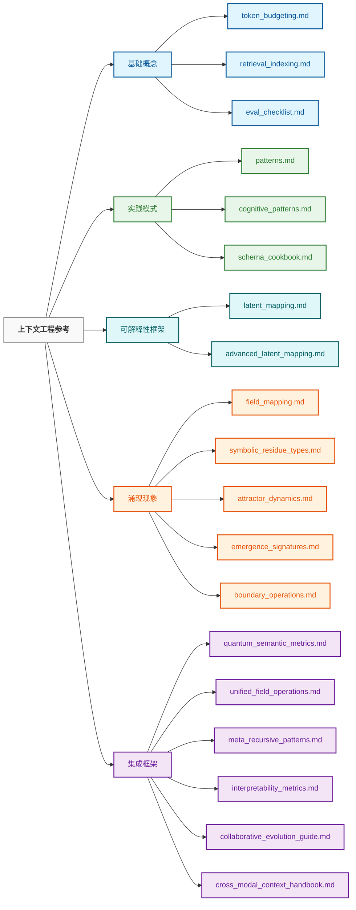

# 上下文工程：参考文档

> "我们根据本族语言的线条来剖析自然。"
>
> [**— 本杰明·李·沃尔夫**](https://en.wikipedia.org/wiki/Benjamin_Lee_Whorf)，[**萨皮尔-沃尔夫语言相对论假说**](https://en.wikipedia.org/wiki/Linguistic_relativity)的创始人
>
>
> 语言影响思维而非思维影响语言的概念
>
> 这在我们的上下文工程领域中特别相关，因为我们的任务是指导和调试代理思维

## 概述

欢迎来到上下文工程资源库的参考文档部分。此目录包含全面的指南、分类和技术规范，为上下文工程实践提供理论基础和实际参考。

这些参考材料旨在补充在 `10_guides_zero_to_hero` 和 `30_examples` 目录中找到的更实操指南，提供对底层概念、模式和框架的更深入的洞察。

```
┌─────────────────────────────────────────────────────────┐
│                参考架构                                  │
├─────────────────────────────────────────────────────────┤
│                                                         │
│  基础 → 模式 → 现象 → 应用                               │
│  (概念)   (方法)   (效应)   (用例)                       │
│                                                         │
│  • 理解底层理论                                         │
│  • 建立共同词汇                                         │
│  • 建立评估框架                                         │
│  • 记录领域共识和开放问题                                │
│  • 提供设计模式和最佳实践                                │
│                                                         │
└─────────────────────────────────────────────────────────┘
```

## 如何使用本目录

参考文档被组织为五个主要类别，以支持不同的学习和应用需求：

1. **基础概念**：支撑上下文工程的核心原理和框架
2. **实践模式**：用于实现的设计模式、架构和方法论
3. **可解释性框架**：用于理解和可视化AI推理的工具和方法
4. **涌现现象**：上下文系统中复杂涌现属性的文档
5. **集成框架**：将方法组合成综合系统的指南

### 学习路径

对于初次接触上下文工程的人员，我们推荐以下学习路径：



## 目录内容

### 基础概念

| 文档 | 描述 | 关键应用 |
|------|------|--------|
| **[token_budgeting.md](./token_budgeting.md)** | 通过资源分配策略优化令牌使用的综合指南 | 预算规划、成本优化、上下文窗口管理 |
| **[retrieval_indexing.md](./retrieval_indexing.md)** | 信息检索系统和索引方法的参考 | RAG实现、知识库设计、检索优化 |
| **[eval_checklist.md](./eval_checklist.md)** | 上下文工程系统的评估方法论和标准 | 质量评估、性能测量、系统验证 |

### 实践模式

| 文档 | 描述 | 关键应用 |
|------|------|--------|
| **[patterns.md](./patterns.md)** | 上下文工程系统的通用设计模式 | 架构设计、解决方案开发、模式识别 |
| **[cognitive_patterns.md](./cognitive_patterns.md)** | 用于增强AI认知能力的推理模式库 | 推理增强、认知支架、问题求解框架 |
| **[schema_cookbook.md](./schema_cookbook.md)** | 用于结构化信息表示的架构设计模式集合 | 数据建模、知识表示、信息组织 |

### 可解释性框架

| 文档 | 描述 | 关键应用 |
|------|------|--------|
| **[latent_mapping.md](./latent_mapping.md)** | AI潜在空间可视化和分析的介绍 | 模型理解、概念映射、表示可视化 |
| **[advanced_latent_mapping.md](./advanced_latent_mapping.md)** | 通过潜在空间跟踪和分析AI推理的高级技术 | 电路追踪、残差检测、字段突变、元分析 |

### 涌现现象

| 文档 | 描述 | 关键应用 |
|------|------|--------|
| **[field_mapping.md](./field_mapping.md)** | 语义字段的可视化和理解指南 | 字段理论应用、语义空间导航、概念映射 |
| **[symbolic_residue_types.md](./symbolic_residue_types.md)** | 符号残差及其分类的分类法 | 推理分析、偏差检测、可解释性研究 |
| **[attractor_dynamics.md](./attractor_dynamics.md)** | 上下文系统中吸引子行为和动力学的参考 | 吸引子设计、稳定性工程、语义重力控制 |
| **[emergence_signatures.md](./emergence_signatures.md)** | 识别和处理涌现模式的指南 | 涌现特性检测、复杂系统分析、不可预测行为管理 |
| **[boundary_operations.md](./boundary_operations.md)** | 语义字段边界管理的参考 | 字段容纳、上下文隔离、边界渗透性控制 |

### 集成框架

| 文档 | 描述 | 关键应用 |
|------|------|--------|
| **[quantum_semantic_metrics.md](./quantum_semantic_metrics.md)** | 观察者依赖的语义解释度量 | 多视角分析、歧义测量、解释框架设计 |
| **[unified_field_operations.md](./unified_field_operations.md)** | 跨多个领域的集成字段操作指南 | 跨域集成、整体系统设计、字段协调 |
| **[meta_recursive_patterns.md](./meta_recursive_patterns.md)** | 自我改进和递归系统的模式 | 自优化、递归增强、元认知框架 |
| **[interpretability_metrics.md](./interpretability_metrics.md)** | 系统透明度的度量和方法论 | 透明度测量、可解释性评估、可解释性框架 |
| **[collaborative_evolution_guide.md](./collaborative_evolution_guide.md)** | 人工智能协作开发指南 | 伙伴关系设计、共同演化框架、协作智能 |
| **[cross_modal_context_handbook.md](./cross_modal_context_handbook.md)** | 多模态集成手册 | 跨模态系统、统一表示、模态桥接 |

## 潜在映射：理解AI推理

潜在映射文档提供了理解和可视化AI推理过程的基本框架：

```
┌─────────────────────────────────────────────────────────┐
│               潜在映射进展                               │
├─────────────────────────────────────────────────────────┤
│                                                         │
│  基础               →       高级技术                      │
│  latent_mapping.md         advanced_latent_mapping.md   │
│                                                         │
│  • 基本可视化       • 电路追踪                           │
│  • 概念映射         • 符号残差检测                       │
│  • 注意力模式       • 壳堆叠分析                         │
│  • 简单干预         • 字段突变技术                       │
│  • 表示分析         • 元递归分析                         │
│                                                         │
└─────────────────────────────────────────────────────────┘
```

### 从基础到高级潜在映射

潜在映射文档形成了一个渐进的学习路径：

1. **基础理解** (latent_mapping.md)
   - 学习可视化基本的AI思维过程
   - 在潜在空间中映射概念表示
   - 理解注意力机制
   - 执行简单干预

2. **高级分析** (advanced_latent_mapping.md)
   - 像追踪电气路径一样追踪神经电路
   - 追踪AI推理留下的符号残差
   - 堆叠上下文壳来理解分层含义
   - 实时变更思想字段
   - 执行递归自检查

这些文档特别有价值，用于：
- 理解AI系统如何实际推理
- 检测偏差和失败模式
- 增强复杂系统的可解释性
- 设计更有效的上下文工程解决方案

## 实现方法论

参考材料支持结构化的实现方法论：

```
┌─────────────────────────────────────────────────────────┐
│               实现工作流                                 │
├─────────────────────────────────────────────────────────┤
│                                                         │
│  1. 分析                                                 │
│     ↓                                                   │
│     • 理解系统需求                                      │
│     • 定义上下文工程目标                                 │
│     • 识别资源约束                                      │
│                                                         │
│  2. 设计                                                 │
│     ↓                                                   │
│     • 选择合适的模式                                    │
│     • 定义字段架构                                      │
│     • 创建架构结构                                      │
│                                                         │
│  3. 实现                                                 │
│     ↓                                                   │
│     • 构建令牌预算计划                                  │
│     • 开发上下文结构                                    │
│     • 集成字段操作                                      │
│                                                         │
│  4. 评估                                                 │
│     ↓                                                   │
│     • 应用评估检清单                                    │
│     • 测量性能指标                                      │
│     • 评估可解释性                                      │
│                                                         │
│  5. 优化                                                 │
│     ↓                                                   │
│     • 优化令牌分配                                      │
│     • 增强字段动力学                                    │
│     • 实现元递归改进                                    │
│                                                         │
└─────────────────────────────────────────────────────────┘
```

## 应用领域

这些参考材料支持广泛的应用领域：

### 基础应用

- **对话AI**：增强对话系统的连贯性、记忆和推理能力
- **RAG系统**：优化外部知识的检索和集成
- **内容生成**：改进生成内容的质量、风格和连贯性
- **域适应**：通过最小微调将模型适应特定领域

### 高级应用

- **多智能体系统**：设计和编排复杂的智能体交互
- **涌现行为控制**：管理和利用涌现属性
- **基于字段的推理**：使用字段理论实现复杂推理框架
- **自演化系统**：创建通过递归自修改改进的系统
- **AI可解释性研究**：应用潜在映射技术理解模型行为

## 从理论到实践

参考文档通过以下方式设计以架构理论和实践的桥梁：

```
┌─────────────────────────────────────────────────────────┐
│               理论-实践桥梁                               │
├─────────────────────────────────────────────────────────┤
│                                                         │
│  概念理解          │           实际应用                  │
│                   │                                     │
│  • 潜在空间    ───────→ • 可视化工具                     │
│    表示            │                                     │
│                   │                                     │
│  • 字段理论    ───────→ • 字段实现                       │
│                   │     技术                             │
│                   │                                     │
│  • 符号残差    ───────→ • 残差检测方法                   │
│                   │                                     │
│  • 涌现模式    ───────→ • 涌现管理                       │
│                   │     方法                             │
│                   │                                     │
│  • 量子语义    ───────→ • 多视角                         │
│                   │     可解释性                         │
│                   │                                     │
└─────────────────────────────────────────────────────────┘
```

## 贡献指南

此参考目录旨在随上下文工程领域的发展而增长和演进。欢迎在以下领域做出贡献：

- **新参考文档**：针对新兴概念的其他参考材料
- **现有文档增强**：现有文档的扩展、澄清和更新
- **视觉辅助**：增强理解的图表、图表和可视化
- **案例研究**：将这些参考材料应用于现实问题的文档化应用
- **集成指南**：与其他框架和技术集成的参考

请参见主资源库中的 [CONTRIBUTING.md](../../.github/CONTRIBUTING.md) 了解提交指南。

## 未来方向

参考材料将在以下几个关键方向继续演进：

1. **定量度量**：开发更精确的测量框架
2. **跨模态集成**：扩大多模态上下文工程覆盖范围
3. **行业特定指南**：针对不同部门的专业参考材料
4. **可解释性框架**：理解上下文系统的高级方法
5. **形式验证**：正式验证上下文工程系统的方法
6. **符号残差分析**：进一步开发残差检测和解释技术
7. **递归元分析**：为能够自我分析和改进的系统增强框架

---

本README概述了 `40_reference/` 目录中可用的参考材料。如需更多实践指导，请参阅 `10_guides_zero_to_hero/` 目录；如需实际示例，请参阅 `30_examples/` 目录。

请记住，上下文工程既是一门艺术也是一门科学——这些参考材料提供了科学基础，但有效应用它们需要实践、实验和创意。
