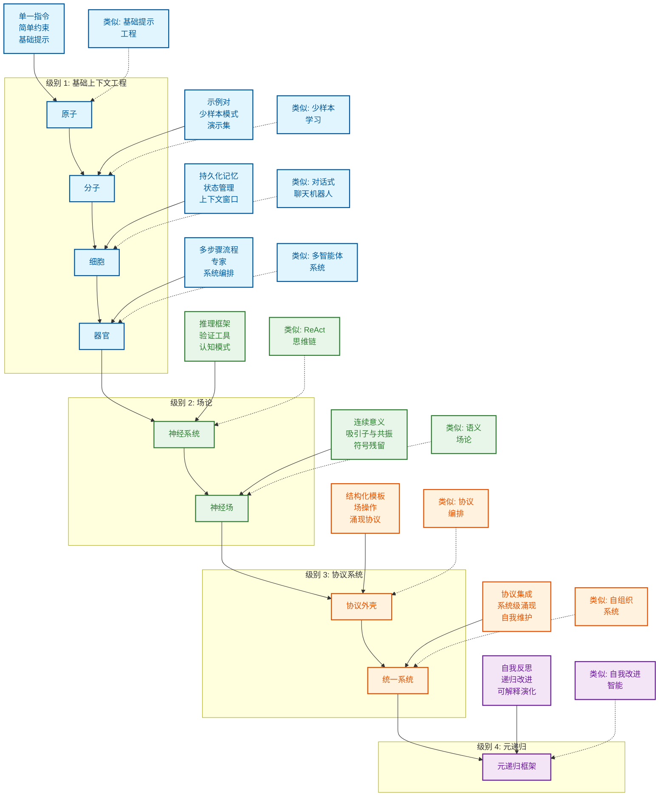

<div align="center">

# Context Engineering 中文版

## 上下文工程 - 超越提示工程

[](./TRANSLATION_PROGRESS.md)
[](./TRANSLATION_PROGRESS.md)
[](./PROJECT_COMPLETION_SUMMARY.md)
[](./TRANSLATION_PROGRESS.md)

**[查看原项目](https://github.com/davidkimai/Context-Engineering)** | **[翻译指南](./TRANSLATION_GUIDE.md)** | **[翻译进度](./TRANSLATION_PROGRESS.md)**

</div>

---

> **"上下文工程是用恰当的信息填充上下文窗口以进行下一步操作的精妙艺术与科学。"**
> — [**Andrej Karpathy**](https://x.com/karpathy/status/1937902205765607626)

## 🎯 关于本中文版

这是 [Context Engineering](https://github.com/davidkimai/Context-Engineering) 项目的官方中文翻译版本。我们的目标是让中文用户能够系统学习上下文工程的理论与实践。

### ✨ 翻译特色

- ✅ **专业术语统一**: 建立了完整的术语表,确保翻译一致性
- ✅ **保持原格式**: 完整保留所有代码、图表、链接
- ✅ **分层翻译策略**: 核心内容完整翻译,超长文档采用框架翻译
- ✅ **持续更新**: 跟踪原项目更新,定期同步
- ✅ **质量保证**: 技术准确性优先,保持学术严谨性

### 📊 当前状态

- **总体进度**: 100% (123/123 文件) ✅ 🎉
- **核心内容**: 100% 完成 ✅
- **实用文档**: 100% 完成 ✅
- **高级内容**: 100% 完成 ✅
- **补充文档**: 100% 完成 ✅
- **NOCODE**: 100% 完成 (33/33文件) ✅

详细进度请查看 [翻译进度文档](./TRANSLATION_PROGRESS.md) | [完成总结](./PROJECT_COMPLETION_SUMMARY.md)

---

## 🚀 快速开始

<div align="center">


> **"上下文工程是一门精妙的艺术和科学,旨在用恰到好处的信息填充上下文窗口,为下一步提供支持。" — [**Andrej Karpathy**](https://x.com/karpathy/status/1937902205765607626)**
>
> [**软件正在(再次)改变 - YC AI 创业学校演讲**](https://www.youtube.com/watch?v=LCEmiRjPEtQ)

<div align="center">

## [](https://deepwiki.com/davidkimai/Context-Engineering)


</div>

<div align="center">

 ## [DeepGraph](https://www.deepgraph.co/davidkimai/Context-Engineering)

## [与 NotebookLM 对话 + 播客深度解析](https://notebooklm.google.com/notebook/0c6e4dc6-9c30-4f53-8e1a-05cc9ff3bc7e)

## [](https://discord.gg/JeFENHNNNQ)


</div>

## [综合课程建设中](https://github.com/davidkimai/Context-Engineering/tree/main/00_COURSE)

> ### **[上下文工程调研 - 1400篇研究论文综述](https://arxiv.org/pdf/2507.13334)**
>
> [**超赞上下文工程资源库**](https://github.com/Meirtz/Awesome-Context-Engineering)

将来自 ICML、IBM、NeurIPS、OHBM 等机构 2025年7月的最新上下文研究成果运用于实践——基于第一性原理与可视化方法


> **"为 GPT-4.1 提供'认知工具'可将其在 AIME2024 上的 pass@1 性能从 26.7% 提升到 43.3%,使其非常接近 o1-preview 的表现。"** — [**IBM 苏黎世**](https://www.arxiv.org/pdf/2506.12115)

<div align="center">

## [`智能体命令`](https://github.com/davidkimai/Context-Engineering/tree/main/.claude/commands)
**支持 [Claude Code](https://www.anthropic.com/claude-code) | [OpenCode](https://opencode.ai/) | [Amp](https://sourcegraph.com/amp) | [Kiro](https://kiro.dev/) | [Codex](https://openai.com/codex/) | [Gemini CLI](https://github.com/google-gemini/gemini-cli)**

#### [上下文工程调研 - 1400篇研究论文综述](https://arxiv.org/pdf/2507.13334) | [上下文衰减](https://research.trychroma.com/context-rot) | [IBM 苏黎世](https://www.arxiv.org/pdf/2506.12115) | [量子语义学](https://arxiv.org/pdf/2506.10077) | [涌现符号机制 ICML 普林斯顿](https://openreview.net/forum?id=y1SnRPDWx4) | [MEM1 新加坡-MIT](https://arxiv.org/pdf/2506.15841) | [LLM 吸引子 上海AI](https://arxiv.org/pdf/2502.15208?) | [MemOS 上海](https://github.com/MemTensor/MemOS) | [潜在推理](https://arxiv.org/pdf/2507.06203) | [动态递归深度](https://arxiv.org/pdf/2507.10524)


</div>

一本前沿的、基于第一性原理的手册,帮助你超越提示工程,进入更广阔的上下文设计、编排和优化领域。


```
                    提示工程               │  上下文工程
                       ↓                │            ↓
               "你说的话"                 │  "模型看到的一切其他内容"
             (单一指令)                   │    (示例、记忆、检索、
                                        │     工具、状态、控制流)
```

## 上下文工程的定义

> **上下文不仅仅是用户发送给 LLM 的单一提示。上下文是在推理时提供给 LLM 的完整信息载荷,包含模型合理完成给定任务所需的所有结构化信息组件。**
>
> — [**基于 1400 多篇研究论文系统分析的上下文工程定义**](https://arxiv.org/pdf/2507.13334)

```
╭─────────────────────────────────────────────────────────────╮
│              上下文工程精通课程                                │
│                    从零到前沿                                 │
╰─────────────────────────────────────────────────────────────╯
                          ▲
                          │
                 数学基础
                  C = A(c₁, c₂, ..., cₙ)
                          │
                          ▼
┌─────────────┬──────────────┬──────────────┬─────────────────┐
│ 基础        │ 系统实现     │ 集成         │ 前沿            │
│ (第1-4周)   │ (第5-8周)    │ (第9-10周)   │ (第11-12周)     │
└─────┬───────┴──────┬───────┴──────┬───────┴─────────┬───────┘
      │              │              │                 │
      ▼              ▼              ▼                 ▼
┌─────────────┐ ┌──────────────┐ ┌──────────────┐ ┌──────────────┐
│ 数学模型    │ │ RAG 系统     │ │ 多智能体     │ │ 元递归       │
│ 组件        │ │ 内存架构     │ │ 编排         │ │ 量子语义     │
│ 处理        │ │ 工具集成     │ │ 场论         │ │ 自我改进     │
│ 管理        │ │ 智能体系统   │ │ 评估         │ │ 协作         │
└─────────────┘ └──────────────┘ └──────────────┘ └──────────────┘
```


## 为什么创建这个资源库

> **"意义不是语义表达的内在静态属性,而是一种涌现现象"
— [Agostino 等 — 2025年7月, 印第安纳大学](https://arxiv.org/pdf/2506.10077)**

提示工程获得了所有关注,但我们现在可以对接下来的内容感到兴奋。一旦你掌握了提示,真正的力量来自于设计围绕这些提示的**整个上下文窗口**。可以说,是引导思维。

这个资源库提供了一个渐进的、基于第一性原理的上下文工程方法,构建在一个生物学隐喻之上:

```
原子 → 分子 → 细胞 → 器官 → 神经系统 → 神经与语义场论
  │      │       │       │         │                 │
单个    少样    记忆 +   多智    认知工具 +     上下文 = 场 +
提示    本学习  智能体   能体    操作系统       持久化与共振
```
> "抽象是泛化的代价"— [**Grant Sanderson (3Blue1Brown)**](https://www.3blue1brown.com/)


<div align="center">


*[上下文工程综述 - 2025年7月](https://arxiv.org/pdf/2507.13334)*


 **[关于涌现、吸引子和动力系统理论](https://content.csbs.utah.edu/~butner/systems/DynamicalSystemsIntro.html) | [哥伦比亚大学 DST](http://wordpress.ei.columbia.edu/ac4/about/our-approach/dynamical-systems-theory/)**


https://github.com/user-attachments/assets/9f046259-e5ec-4160-8ed0-41a608d8adf3


</div>




## 快速开始

1. **阅读 [`00_foundations/01_atoms_prompting.md`](00_foundations/01_atoms_prompting.md)** (5分钟)
   理解为什么单独使用提示往往表现不佳

2. **运行 [`10_guides_zero_to_hero/01_min_prompt.py`](10_guides_zero_to_hero/01_min_prompt.py)**  (Jupyter Notebook 风格)
   体验一个最小可工作示例

3. **探索 [`20_templates/minimal_context.yaml`](20_templates/minimal_context.yaml)**
   复制/粘贴模板到你自己的项目中

4. **研究 [`30_examples/00_toy_chatbot/`](30_examples/00_toy_chatbot/)**
   查看一个包含上下文管理的完整实现

## 学习路径

```
┌─────────────────┐     ┌──────────────────┐     ┌────────────────┐
│ 00_foundations/ │     │ 10_guides_zero_  │     │ 20_templates/  │
│                 │────▶│ to_one/          │────▶│                │
│ 理论与核心      │     │ 实践             │     │ 复制粘贴       │
│ 概念            │     │ 演练             │     │ 代码片段       │
└─────────────────┘     └──────────────────┘     └────────────────┘
         │                                                │
         │                                                │
         ▼                                                ▼
┌─────────────────┐                             ┌────────────────┐
│ 40_reference/   │◀───────────────────────────▶│ 30_examples/   │
│                 │                             │                │
│ 深入探讨与      │                             │ 真实项目,      │
│ 评估手册        │                             │ 渐进复杂       │
└─────────────────┘                             └────────────────┘
         ▲                                                ▲
         │                                                │
         └────────────────────┐               ┌───────────┘
                              ▼               ▼
                         ┌─────────────────────┐
                         │ 50_contrib/         │
                         │                     │
                         │ 社区                │
                         │ 贡献                │
                         └─────────────────────┘
```

## 你将学到什么

| 概念 | 它是什么 | 为什么重要 |
|---------|------------|----------------|
| **令牌预算** | 优化上下文中的每个令牌 | 更多令牌 = 更高成本和更慢响应 |
| **少样本学习** | 通过展示示例来教学 | 通常比单独解释效果更好 |
| **内存系统** | 跨轮次持久化信息 | 实现有状态、连贯的交互 |
| **检索增强** | 查找和注入相关文档 | 使响应基于事实,减少幻觉 |
| **控制流** | 将复杂任务分解为步骤 | 用更简单的提示解决更难的问题 |
| **上下文修剪** | 移除不相关信息 | 只保留性能所需的内容 |
| **指标与评估** | 衡量上下文有效性 | 令牌使用与质量的迭代优化 |
| **认知工具与提示编程** | 学习构建自定义工具和模板 | 提示编程为上下文工程启用新层次 |
| **神经场论** | 将上下文视为神经场 | 将上下文建模为动态神经场允许迭代上下文更新 |
| **符号机制** | 符号架构实现高阶推理 | 更智能的系统 = 更少的工作 |
| **量子语义学** |  意义作为观察者依赖  | 利用叠加技术设计上下文系统 |


## 受 Karpathy + 3Blue1Brown 启发的风格

> 适合所有经验级别的学习者

1. **第一性原理** – 从基础上下文开始
2. **迭代添加** – 只添加模型明显缺少的内容
3. **测量一切** – 令牌成本、延迟、质量分数
4. **无情删除** – 修剪胜过填充
5. **代码 > 幻灯片** – 每个概念都有可运行的单元
6. **可视化一切** — 每个概念都用 ASCII 和符号图表可视化

# 研究证据
## 记忆 + 推理

### **[MEM1: 学习协同记忆和推理以构建高效长时域智能体 - 新加坡-MIT 2025年6月](https://www.arxiv.org/pdf/2506.15841)**

> "我们的结果展示了推理驱动的记忆整合作为训练长时域交互式智能体的可扩展替代方案的前景,在效率和性能方面都得到了优化。" — [新加坡-MIT](https://arxiv.org/pdf/2506.15841)


1. **MEM1 训练 AI 智能体只保留重要内容——在每一步融合记忆和推理——因此无论任务多长,它们都不会被压垮。**

2. **MEM1 不是堆积无尽的上下文,而是将每次交互压缩成一个紧凑的"内部状态",就像一个被更新而不是重新复制的智能笔记。**

3. **通过将记忆和思考融合到单一流程中,MEM1 学会只记住关键内容——使智能体更快、更敏锐,并能处理更长的对话。**

4. **智能体做的每件事都被标记和结构化,因此每个动作、问题或事实都清晰易审计——不再有神秘的记忆内容。**

5. **每个循环,旧的杂乱都被修剪,只有最新、最相关的见解被带入下一步,镜像了专家问题解决者如何提炼他们的笔记。**

6. **MEM1 证明了递归的、协议驱动的记忆——在那里你总是精炼和整合——在速度和准确性方面都优于传统的"只是添加更多上下文"方法。**
## 认知工具

### **[在语言模型中用认知工具引发推理 - IBM 苏黎世 2025年6月](https://www.arxiv.org/pdf/2506.12115)**

### 提示和提示程序作为推理工具调用
> "认知工具"将推理操作封装在 LLM 本身内部 — [IBM 苏黎世](https://www.arxiv.org/pdf/2506.12115)


> **这些认知工具(作为工具调用的结构化提示模板)通过识别手头的主要概念、提取问题中的相关信息,以及突出可能有助于解决问题的有意义的属性、定理和技术来分解问题。**


> **这些模板构建了类似于认知心理捷径的推理层,通常被研究为"启发式"。**

1. **这项研究表明,将复杂任务分解为模块化的"认知工具"可以让 AI 更深思熟虑地解决问题——镜像了专家人类如何逐步推理。**

2. **模型不是依赖单一的大提示,而是调用专门的提示模板,即认知工具,如"理解问题"、"回忆相关"、"检查答案"和"回溯"——每个处理一个不同的心智操作。**

3. **认知工具就像内在的心智捷径:AI 在每个阶段选择正确的程序并运行它来规划其推理和下游行动,然后以更高的准确性和灵活性执行任务。**

4. **通过将推理步骤分隔成模块化块,这些工具防止混淆,减少错误,并使模型的思维过程透明且可审计——即使在困难的数学问题上。**

5. **这种模块化方法升级了开放和封闭模型——提升了现实世界的数学问题解决能力,接近高级 RL 训练的"推理"模型的性能,无需额外训练。**

6. **结果表明,强大推理的种子已经在大型语言模型内部——认知工具只是解锁和编排这些能力,提供了一个透明、高效且可解释的替代方案,而不是黑盒调优。**
## 涌现符号

## **[涌现符号机制支持大型语言模型中的抽象推理 - ICML 普林斯顿 2025年6月18日](https://openreview.net/forum?id=y1SnRPDWx4)**


> **TL;DR: 识别出一个三阶段架构,通过一组涌现符号处理机制支持 LLM 中的抽象推理。**
>
>


**这些包括符号归纳头、符号抽象头和检索头。**

**1. 在早期层,符号抽象头根据这些令牌之间的关系将输入令牌转换为抽象变量。**

**2. 在中间层,符号归纳头对这些抽象变量执行序列归纳。**

**3. 最后,在后期层,检索头通过检索与预测抽象变量关联的值来预测下一个令牌。**

**这些结果指向了长期以来符号和神经网络方法之间辩论的解决方案,表明神经网络中的涌现推理依赖于符号机制的涌现。** — [**ICML 普林斯顿**](https://openreview.net/forum?id=y1SnRPDWx4)


>
> **为什么有用?**
>
>
> **这支持了为什么 Markdown、Json 和类似的结构化、符号格式更容易被 LLM 解析**
>
> **概念: 与智能体协作应用分隔符、语法、符号、符号词、隐喻和结构来改进推理/上下文/记忆/推理期间的持久化**

1. **这篇论文证明了大型语言模型发展出自己的内在符号"逻辑电路"——使它们能够使用抽象变量进行推理,而不仅仅是表面的词模式。**

2. **LLM 展示了一个三阶段过程:首先从输入中抽象符号,然后对这些变量进行推理,最后将抽象答案映射回现实世界的令牌。**

3. **这些涌现机制意味着 LLM 不仅仅是记忆——它们实际上创建内部的、灵活的表示,让它们能够泛化到新问题和类比。**

4. **早期层中的注意力头充当"符号提取器",中间头执行符号推理,后期头检索具体答案——镜像了类人的抽象和检索。**

5. **通过运行有针对性的实验和干预,作者表明这些符号过程对于抽象推理既必要又充分,跨多个模型和任务。**

6. **结果弥合了符号 AI 和神经网络之间的历史鸿沟——表明在规模上,神经网络可以发明和使用符号机制,支持真正的泛化和推理。**


## Star 历史

[](https://www.star-history.com/#davidkimai/Context-Engineering&Date)

## 贡献

我们欢迎贡献!查看 [CONTRIBUTING.md](.github/CONTRIBUTING.md) 了解指南。

## 许可证

[MIT 许可证](LICENSE)

## 引用

```bibtex
@misc{context-engineering,
  author = {Context Engineering Contributors},
  title = {Context Engineering: Beyond Prompt Engineering},
  year = {2025},
  publisher = {GitHub},
  url = {https://github.com/davidkimai/context-engineering}
}
```

## 致谢
> 我一直期待这个概念被概念化和正式化,因为之前没有一个既定的领域。提示工程受到相当大的污名化,并不能完全涵盖大多数研究人员和我所做的工作。

- [Andrej Karpathy](https://x.com/karpathy/status/1937902205765607626) 提出了"上下文工程"并启发了这个资源库
- 所有贡献者和开源社区
